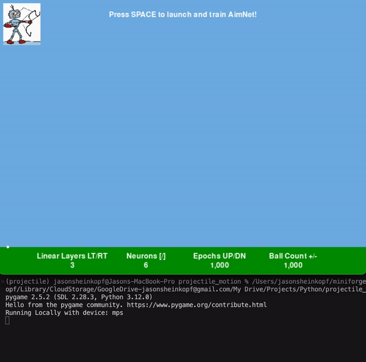
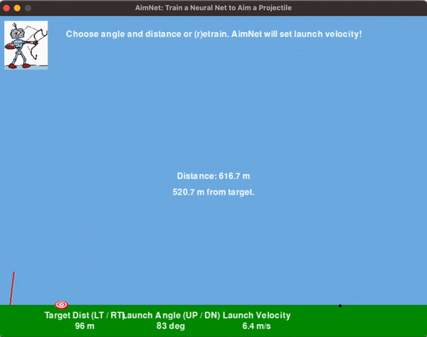

<a href="https://www.buymeacoffee.com/jasonsheinkopf" target="_blank"></a>

# AimNET 
AimNET is projectile motion simulator that allows the user to train a customizable neural network on thousands of data points and then use the model to predict the initial velocity required to hit a target.

# How it Works
### Step 1. Launch projectiles, save data to pandas df, train neural network

  

### Step 2. Run inference on entire test dataset and plot results

  

### Step 3. Allow user to select features and run inference on model to update launch velocity

  

# Installation
## 1. Clone the Repository
```bash
git clone https://github.com/jasonsheinkopf/projectile_motion_neural_network
```
## 2. Create virtual environment from .yml
```bash
conda env create -f projectile.yml
```
## 3. Activate virtual environment
```bash
conda activate projectile
```
## 4. Run projectile.py
```bash
python projectile.py
```
